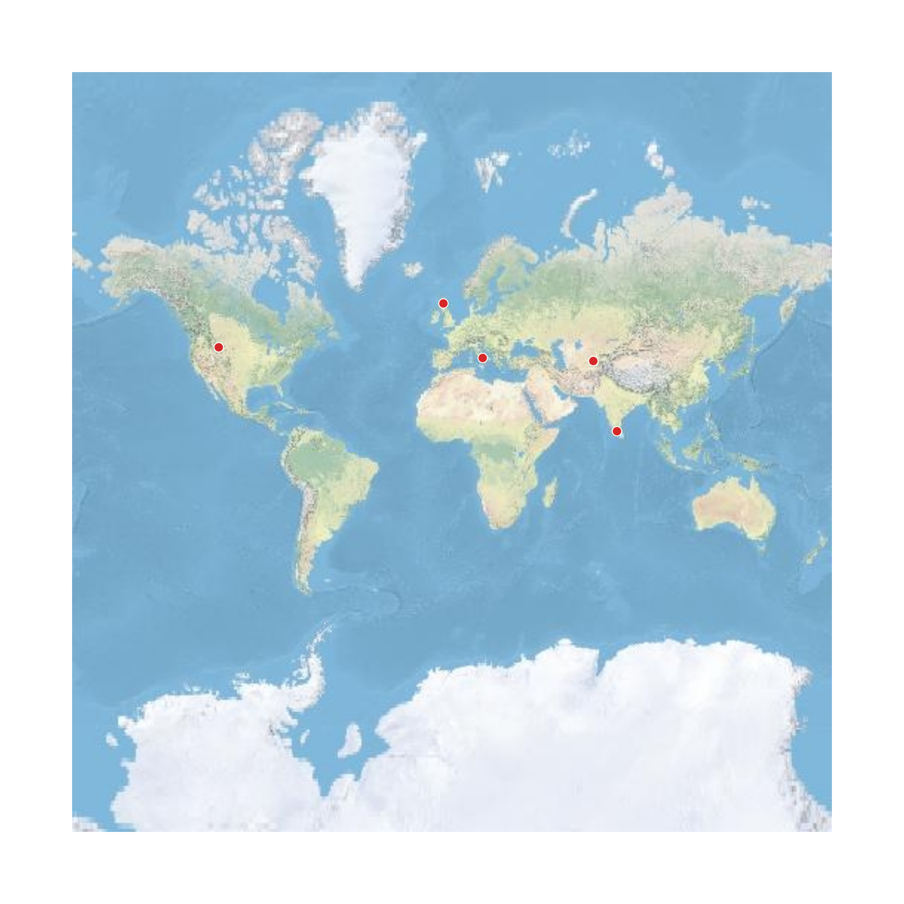

# Pin dot

A Python script to plot any number of places on a terrain map, by using latitude/longitude (if provided) or automatic geocoding.




## Features

- Plots multiple locations on a clean terrain basemap
- Supports:
  - Direct latitude/longitude input
  - Automatic geocoding (through Nominatim of OpenStreetMap)
- Automatically adjusts map extent (local or global view)
- Caches geocoding results for faster repeated runs

## How to use

Internet is needed. Large datasets take a bit of time to render. Geocoding is through the Nominatim service of OpenStreetMap, which is rate-limited.

1.  Create a `.csv` file that contains the following four columns: `place_name`, `place_country`, `lat`, `lon`. Enter the place details in this file. An example file is at [example CSV file](data/example_country.csv). The values for `lat` and `lon` are optional; if absent, the script geocodes the location.
    ```
	place_name,place_country,lat,lon
	Samarkand,Uzbekistan,39.652451,66.970139
	Pompeii,Italy,40.746157,14.498934
	Inverness,United Kingdom,57.477772,-4.224721
	Yellowstone National Park,United States of America,44.446037,-110.587349
	Madurai,India,9.939093,78.121719
	```
1.  If you don't have Python already, install it.  Then, install the required packages by running the following command: `pip install -r requirements.txt`.
1.  Download the `pin-dot.py` file from this repository, and run it with the following command: `python pin-dot.py`.
1.  When prompted, enter the full path of the `.csv` file you created in the first step.

## Outputs

- A time-stamped `.png` file, showing the points on a map.
- A `.json` cache file, to store geocoded locations when `lat` and `long` are absent, so that subsequent runs with the same place names are faster.
- A `.geojson` file, for cached country boundaries, which is downloaded once and then used in all subsequent runs.

## License

MIT

